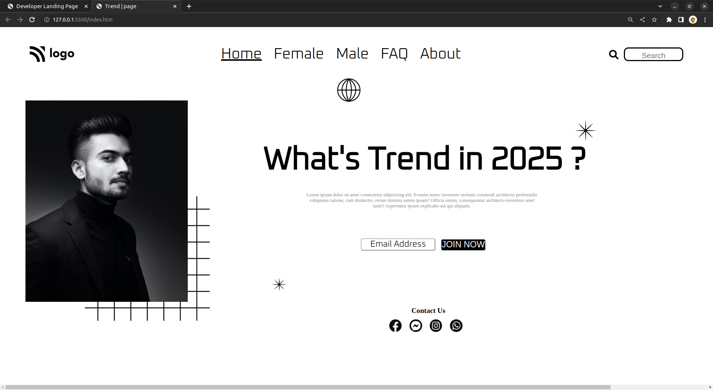

# Trend | Page - HTML & CSS!

By Prince Kr Paswan

## [Link to the Trend-Page (project-1)](https://trend-page1.netlify.app/)

## What I learned While creating this page?

- Learnd to use css position [Relative & Absolute] property.

- I learned about z indexing to stack elements on top of each other.
- I learned how to add custom fonts

## This project took around 4 hours to complete.